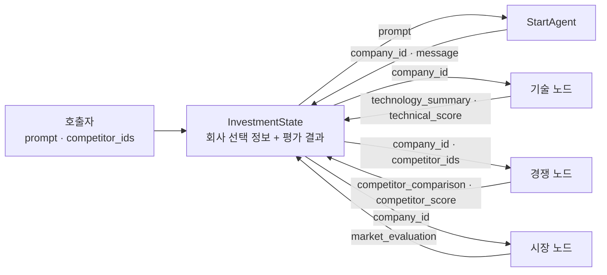
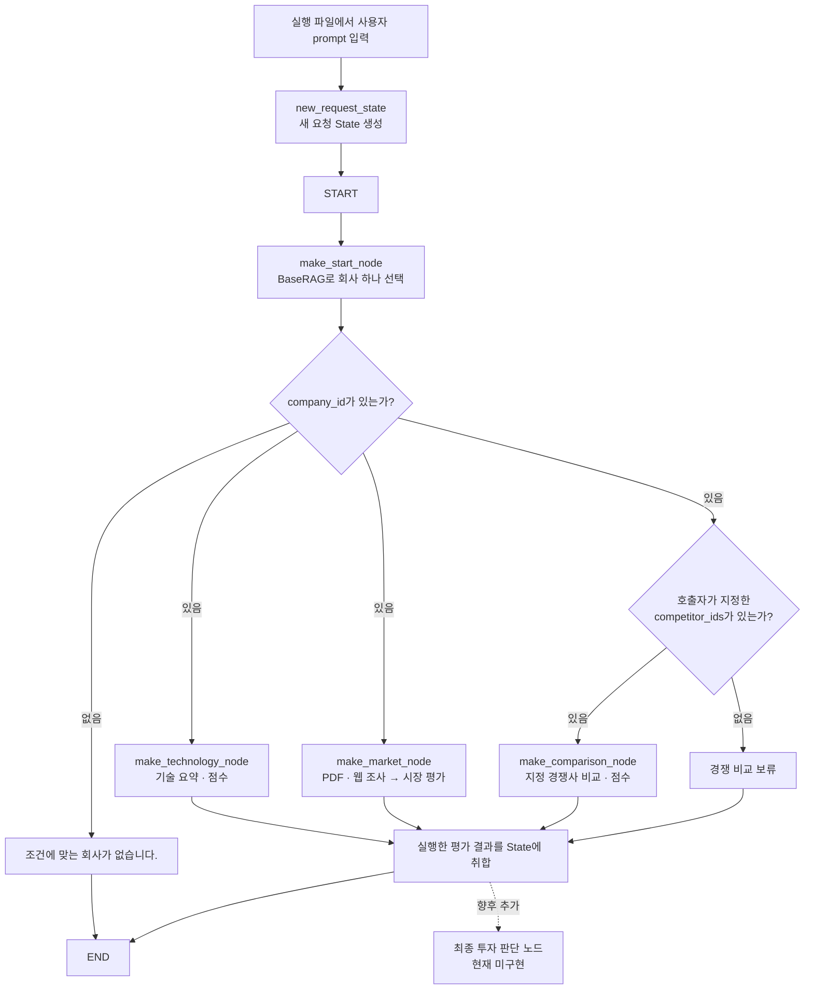

# 스타트업 투자 분석 RAG · 에이전트

기업 CSV와 시장 보고서 PDF를 공용 RAG로 제공하고, 선택한 기업의 기술·경쟁·시장 정보를 분석하는 프로젝트입니다. 각 에이전트는 필요한 RAG를 전달받아 사용하며, 분석 대상 기업은 CSV의 고유한 문자열 `company_id`로 식별합니다.

현재 기업 선택·기술 요약·지정 경쟁사 비교·시장성 평가 모듈과 LangGraph용 노드 어댑터가 구현되어 있습니다. 사용자 입력부터 모든 평가를 실행하는 전체 그래프 조립 파일, 자동 경쟁사 검색, 별도의 신뢰성 평가와 최종 투자 판단 노드는 아직 구현되어 있지 않습니다.

## 디렉토리 구조

```text
blackrubbershoes/
├── README.md
├── main/
│   ├── requirements.txt                 # 전체 모듈 의존성
│   ├── paths.py                         # 저장소 기준 데이터 경로
│   ├── rag/
│   │   ├── embeddings.py                # 공통 OpenAI 임베딩
│   │   ├── company/
│   │   │   ├── __init__.py               # 기업 RAG 공개 import
│   │   │   ├── baseRAG.py                # 기업 조회·검색·색인
│   │   │   ├── data.py                   # CSV 로딩·정규화·필터
│   │   │   ├── models.py                 # 기업·필터·검색 결과 형식
│   │   │   ├── requirements-rag.txt
│   │   │   └── docs/rag-usage.md
│   │   └── market/
│   │       ├── __init__.py               # 시장 RAG 공개 import
│   │       ├── marketRAG.py              # 시장 문서 검색·색인
│   │       ├── pdf_data.py               # PDF 추출·청킹·페이지 정보
│   │       ├── models.py                 # 문서·청크·검색 결과 형식
│   │       ├── requirements-market.txt
│   │       └── docs/rag-usage.md
│   ├── agents/
│   │   ├── common/
│   │   │   ├── __init__.py
│   │   │   ├── evidence.py               # 기업 근거 변환·출처 확인
│   │   │   └── llm.py                    # 채팅 모델 생성·주입
│   │   ├── start/
│   │   │   ├── __init__.py
│   │   │   ├── startAGENT.py             # 프롬프트로 회사 하나 선택
│   │   │   ├── requirements-startagent.txt
│   │   │   └── docs/start-agent-usage.md
│   │   ├── technology/
│   │   │   ├── __init__.py
│   │   │   ├── agent.py                  # 기술 요약·평가 흐름
│   │   │   ├── schemas.py                # 기술 결과 형식
│   │   │   ├── prompts.py                # 기술 평가 프롬프트
│   │   │   ├── scoring.py                # 기술 점수·근거 자격 확인
│   │   │   ├── requirements.txt
│   │   │   └── docs/usage.md
│   │   ├── competition/
│   │   │   ├── __init__.py
│   │   │   ├── agent.py                  # 지정 경쟁사 비교 흐름
│   │   │   ├── schemas.py                # 경쟁 비교 결과 형식
│   │   │   ├── prompts.py                # 경쟁 평가 프롬프트
│   │   │   ├── scoring.py                # 비교 근거 확인·점수 계산
│   │   │   ├── requirements.txt
│   │   │   └── docs/usage.md
│   │   └── market/
│   │       ├── __init__.py
│   │       ├── agent.py                  # 시장 조사·평가 흐름
│   │       ├── schemas.py                # 조사 계획·근거·평가 형식
│   │       ├── scoring.py                # 시장 항목별 가중점수
│   │       ├── openai_backend.py         # 조사 계획·평가 모델 호출
│   │       ├── web_search.py             # 웹 검색·인용 문맥 처리
│   │       ├── requirements.txt
│   │       └── docs/
│   │           ├── market_agent_guide.md
│   │           └── market_scoring_core.md
│   ├── graph/
│   │   ├── __init__.py                   # State·노드 어댑터 공개 import
│   │   ├── state.py                      # InvestmentState·요청 초기화
│   │   └── nodes.py                      # State ↔ 에이전트 연결
│   └── scripts/
│       ├── __init__.py
│       ├── build_company_index.py        # 기업 CSV 색인 준비
│       ├── build_market_index.py         # 시장 PDF 색인 준비
│       ├── run_agents.py                 # 기술·경쟁 평가 결과 JSON 저장
│       └── evaluate_market_company.py    # 시장성 평가 단독 실행
├── docs/data/
│   ├── base/raw/                         # 기업 CSV
│   └── market/
│       ├── raw/                          # 시장 보고서 PDF 6개
│       └── sources.json                  # 문서명·기관·연도·원문 URL
├── examples/reports/                     # 이전 실행의 참고 결과 JSON
├── tests/                                # 로컬 보관, Git 제외
├── compose.qdrant.yml                    # 로컬 Qdrant·저장 볼륨
├── .env.example                          # 환경변수 이름과 모델 설정 예시
└── .gitignore
```

`tests/`는 로컬에만 보관하므로 새로 clone한 저장소에는 포함되지 않습니다. `main/`은 네임스페이스 패키지로 사용합니다. 아래 명령과 import는 모두 저장소 루트에서 실행합니다.

## 폴더와 모듈의 역할

### 공용 RAG: `main/rag`

RAG는 여러 에이전트가 함께 사용하는 데이터 조회·검색 모듈입니다. 선택 중인 회사나 평가 결과를 RAG 객체에 저장하지 않습니다.

| 모듈 | 역할과 주요 기능 |
| --- | --- |
| `embeddings.py` | 기업·시장 문서와 검색 질문을 OpenAI `text-embedding-3-small`로 임베딩. 기본 512차원, 응답 벡터 확인 |
| `company/baseRAG.py` | `get_company()`, `get_field()`, `get_fields()`, `list_companies()`로 CSV 정확 조회. `build_index()`, `retrieve()`로 Qdrant 색인·의미 검색 |
| `company/data.py` | CSV의 고유 ID 확인, 금액·업력·날짜 등 정규화, AND 조건 필터 적용 |
| `company/models.py` | `CompanyRecord`, `CompanyFilter`, `SearchHit`, CSV 출처와 오류 타입 정의 |
| `market/marketRAG.py` | 시장 PDF 청크의 Qdrant 색인·검색. `prepare_chunks()`로 로컬 문서 준비, `retrieve()`로 관련 청크 반환 |
| `market/pdf_data.py` | PDF 텍스트 추출·공백 정리·페이지별 청킹, `sources.json`과 파일 대응 |
| `market/models.py` | 문서 메타데이터·청크·검색 결과와 오류 타입 정의 |

기업의 ID·항목·조건 조회에는 OpenAI나 Qdrant 호출이 필요하지 않습니다. 의미 검색에는 Qdrant와 검색 질문 임베딩이 필요합니다. 기업은 `companies_small_512`, 시장 문서는 `market_reference_pdf_512` 컬렉션을 사용합니다.

PDF 결과의 `page`는 저장한 PDF 내부의 페이지 번호입니다. 발췌 PDF인 경우 원본 보고서의 페이지 번호와 다를 수 있습니다.

### 에이전트: `main/agents`

| 폴더 | 역할 |
| --- | --- |
| `common` | 기업 CSV를 근거 형식으로 변환하고, 출처 ID·회사 소유권·자료 유형을 확인. 채팅 모델 식별자 또는 주입한 모델 객체 처리 |
| `start` | 프롬프트에서 조건을 추출해 전체 CSV에 먼저 필터 적용. 필요한 의미 검색·후보 검토 후 추천·최대·최소·랜덤 방식으로 회사 하나 선택 |
| `technology` | 고객 문제와 해결 방식, AI 역할, 성능 검증, 기술 성숙도를 요약하고 기술 점수 계산 |
| `competition` | 호출자가 지정한 경쟁사와 차별성·성능·방어력·도입 위험 비교. 자동 경쟁사 발굴은 포함하지 않음 |
| `market` | 기업 정보로 조사 계획 생성 → PDF·웹 근거 수집 → 고객 수요·시장 크기·성장·도입 가능성·확장성 평가 |

기술·경쟁 모듈의 `agent.py`는 조회와 모델 호출을 조립하고, `schemas.py`는 결과 형식, `prompts.py`는 프롬프트, `scoring.py`는 점수와 근거 자격을 담당합니다. 시장 모듈은 모델 호출을 `openai_backend.py`, 웹 검색을 `web_search.py`로 분리합니다.

CSV 회사 소개만으로 확인할 수 없는 고객 증언이나 성능 우위는 추가 근거가 필요합니다. 근거가 부족한 점수는 `None`이며 JSON에서는 `null`입니다. 기술·경쟁 점수는 각각 100점 만점입니다. 시장 점수는 100점 만점과 투자 평가 반영용 25점을 함께 반환합니다. 각 영역에서 하나라도 항목 점수가 보류되면 해당 영역의 합계도 보류합니다.

### 그래프·데이터·실행 파일

| 경로 | 역할 |
| --- | --- |
| `main/graph/state.py` | 공통 State 키와 새 요청을 위한 `new_request_state()` 정의 |
| `main/graph/nodes.py` | `make_start_node()`, `make_technology_node()`, `make_comparison_node()`, `make_market_node()`로 노드 함수 생성 |
| `main/paths.py` | CSV·PDF·문서 메타데이터의 기본 경로를 저장소 위치 기준으로 계산 |
| `main/requirements.txt` | 각 폴더의 requirements와 LangGraph 의존성 취합 |
| `main/scripts` | 색인 준비와 개별 에이전트 실행. 전체 LangGraph 실행 파일은 아직 없음 |
| `docs/data` | 에이전트들이 함께 참조하는 기업 CSV와 시장 PDF·출처 메타데이터 |
| `examples/reports` | 구조 정리 전에 생성된 참고 결과. 현재 코드의 검증 결과가 아님 |
| `compose.qdrant.yml` | Qdrant를 `http://localhost:6333`에 실행하고 named volume에 데이터 보존 |

## 공통 State

[InvestmentState](main/graph/state.py)는 LangGraph가 노드 사이에 전달할 공통 딕셔너리 형식입니다. 회사 ID와 보고서는 일반 필드이며 메시지 누적용 `add_messages`를 적용하지 않습니다.

| 키 | 타입 | 입력·생성 주체 | 의미 |
| --- | --- | --- | --- |
| `prompt` | `str` | 실행 파일·호출자 | 회사 선택 조건 |
| `company_id` | `str \| None` | StartAgent | 선택된 CSV 회사 ID. 무결과이면 `None` |
| `message` | `str \| None` | StartAgent | 무결과 메시지. 선택 성공이면 `None` |
| `competitor_ids` | `list[str]` | 호출자 | 비교할 회사 ID 목록 |
| `technology_summary` | `dict \| None` | 기술 노드 | 기술 요약·근거 |
| `technical_score` | `dict \| None` | 기술 노드 | 기술 항목별 점수·합계 |
| `competitor_comparison` | `dict \| None` | 경쟁 노드 | 지정 경쟁사와 비교한 보고서 |
| `competitor_score` | `dict \| None` | 경쟁 노드 | 경쟁 항목별 점수·합계 |
| `market_evaluation` | `dict \| None` | 시장 노드 | 시장 정의·근거·항목별 점수·두 합계 |

다음 그림은 각 노드가 State에서 읽는 값과 반환하는 갱신값을 보여줍니다. 화살표는 데이터 입출력 관계이며 실행 순서를 뜻하지 않습니다.



그래프용 노드 함수는 입력 State를 직접 수정하지 않고 자신이 갱신할 키만 반환합니다. 예를 들어 기술 노드가 반환한 두 키를 LangGraph가 State에 반영하면 `company_id`와 다른 노드의 결과는 유지됩니다.

```python
from main.graph import new_request_state

state = new_request_state(
    "누적 투자액이 가장 큰 회사 하나 골라줘",
    competitor_ids=["14"],  # 형식 예시. 선택된 대상과 다른 회사여야 합니다.
)
```

새 요청은 `new_request_state()`로 보고서를 초기화합니다. `make_start_node()`도 실행할 때 이전 평가 결과를 비우며, 이전 선택과 다른 회사로 바뀌면 `competitor_ids`도 비웁니다. 경쟁사 목록은 대상 회사가 정해진 뒤 다시 지정할 수 있습니다.

## LangGraph 파이프라인 연결 예시

현재 제공하는 노드들을 전체 그래프에서 연결할 때의 흐름입니다. 아래의 조건 분기·병렬 연결·결과 합류는 앞으로 그래프 조립 파일에서 구현해야 합니다.



- `input()`은 전체 그래프를 실행하는 진입 파일에서 받습니다. StartAgent에는 입력 루프가 없습니다.
- `company_id is None`이면 후속 평가 노드를 호출하지 않고 종료하도록 연결합니다. 향후 이 분기를 별도 검색 에이전트로 확장할 수 있습니다.
- 기술·시장 노드는 같은 `company_id`로 독립적으로 평가할 수 있습니다. 경쟁 노드를 실행하려면 대상과 다른, 중복 없는 경쟁사 ID가 필요합니다. ID가 없는 상태로 현재 경쟁 노드를 호출하면 오류가 발생합니다.
- 병렬 평가 후 결과를 읽는 노드는 실행한 평가들이 모두 끝난 뒤 호출하도록 합류를 구성합니다.
- RAG·채팅 모델·시장 검색기 등은 앱 초기화 시 만들어 노드에 전달하고, 전체 실행이 끝나면 소유한 클라이언트를 닫습니다.

## 설치와 단독 실행

Python 3.11 이상을 사용하며, 저장소 루트에서 실행합니다.

```bash
python3 -m venv .venv
source .venv/bin/activate
python -m pip install -r main/requirements.txt

docker compose -p company-rag -f compose.qdrant.yml up -d
export OPENAI_API_KEY="발급받은_API_키"
```

모듈은 `.env`를 자동으로 읽지 않습니다. `.env.example`을 참고해 실행 프로세스에 환경변수를 설정합니다. StartAgent는 호출자가 만든 채팅 모델을 받습니다. 기술·경쟁 모델의 기본 식별자는 `openai:gpt-4.1`, 시장 조사·평가 모델의 기본값은 `gpt-5-mini`이며 코드의 인수나 환경변수로 변경할 수 있습니다.

```bash
# 기업·시장 검색 색인 준비
python -m main.scripts.build_company_index
python -m main.scripts.build_market_index

# 기술·경쟁 평가: 회사 17을 회사 14와 비교하고 JSON 저장
python -m main.scripts.run_agents \
  --company-id 17 --competitor-id 14 \
  --output outputs/company_17_vs_14.json

# 시장성 평가: 회사 17의 결과 JSON을 터미널에 출력
python -m main.scripts.evaluate_market_company 17
```

기존 컬렉션은 차원을 확인한 뒤 재사용합니다. CSV·PDF·`sources.json`을 수정했다면 해당 색인 명령에 `--rebuild`를 붙여 다시 생성합니다. 검색 유사도는 투자 점수나 사실의 신뢰도가 아닙니다.

## 세부 사용 문서

- [기업 RAG](main/rag/company/docs/rag-usage.md)
- [시장 PDF RAG](main/rag/market/docs/rag-usage.md)
- [StartAgent](main/agents/start/docs/start-agent-usage.md)
- [기술 요약](main/agents/technology/docs/usage.md)
- [지정 경쟁사 비교](main/agents/competition/docs/usage.md)
- [시장성 평가 연동](main/agents/market/docs/market_agent_guide.md)
- [시장성 점수 기준](main/agents/market/docs/market_scoring_core.md)
