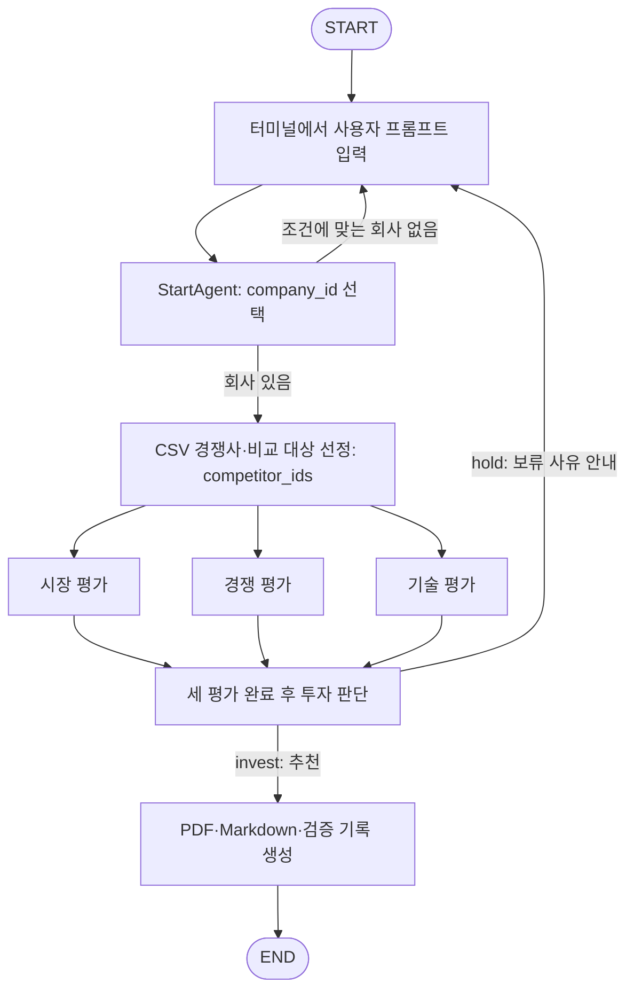
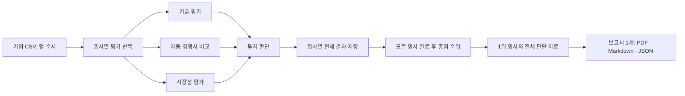

# 스타트업 투자 분석 RAG · 에이전트

기업 CSV와 시장 보고서 PDF를 공용 RAG로 조회하고 기술력·경쟁력·시장성을 평가한 뒤 투자 추천 여부를 계산합니다. 회사는 CSV의 문자열 `company_id`로 식별합니다.

터미널에서 조건을 입력하면 **회사 선택 → CSV 안에서 경쟁사 자동 선정 → 시장·경쟁·기술 병렬 평가 → 투자 판단 → PDF 보고서 생성**을 실행합니다. 추천이면 보고서를 생성한 뒤 종료하고, 보류하거나 조건에 맞는 회사를 찾지 못하면 새 프롬프트를 받습니다. PDF 경로를 포함한 결과를 전체 State JSON으로 저장할 수 있습니다.

보고서 작성 모듈은 판단 결과 JSON으로 한글 PDF·Markdown·검증 기록 JSON을 별도로 생성할 수 있습니다.

CSV 전체 평가에는 별도의 `rank_csv_companies` 명령을 사용합니다. 모든 회사를 평가·저장하고 총점 1위의 보고서 한 개를 생성합니다.

## 폴더 구조

```text
gicheol/
├── README.md
├── main.py                            # 전체 그래프 실행 진입점
├── main/
│   ├── requirements.txt
│   ├── paths.py
│   ├── rag/
│   │   ├── embeddings.py
│   │   ├── company/
│   │   │   ├── baseRAG.py             # 기업 CSV 조회·Qdrant 검색
│   │   │   ├── data.py                # CSV 로딩·정규화
│   │   │   ├── models.py              # 기업 데이터 형식
│   │   │   └── docs/rag-usage.md
│   │   └── market/
│   │       ├── marketRAG.py           # 시장 PDF 색인·검색
│   │       ├── pdf_data.py            # PDF 추출·청킹
│   │       ├── models.py              # 시장 문서 형식
│   │       └── docs/rag-usage.md
│   ├── agents/
│   │   ├── common/                    # 공통 근거·채팅 모델 처리
│   │   ├── start/                     # 프롬프트에서 회사 하나 선택
│   │   ├── technology/                # 기술 요약과 100점 평가
│   │   ├── competition/               # 선정된 기업 비교와 100점 평가
│   │   ├── competitor_selection/
│   │   │   ├── __init__.py
│   │   │   └── agent.py               # 경쟁사·비교 대상 검색과 선정
│   │   ├── market/                    # PDF·웹 조사와 100점 평가
│   │   ├── investment/
│   │   │   ├── agent.py               # 팀 평가 모델·자료 수집 조립
│   │   │   ├── adapter.py             # 세 평가 출력을 판단 입력으로 변환
│   │   │   ├── scoring.py             # 90점+10점 계산과 추천 분기
│   │   │   ├── handoff.py             # 후속 에이전트용 payload
│   │   │   ├── schemas.py             # 판단 State·근거 형식
│   │   │   ├── prompts.py             # 팀 평가 프롬프트
│   │   │   ├── docs/usage.md
│   │   │   └── tests/
│   │   └── report/
│   │       ├── agent.py               # 보고서 LangGraph·노드·Python API
│   │       ├── adapter.py             # 투자 판단 State/payload 변환
│   │       ├── schemas.py             # 보고서 입력 계약
│   │       ├── content.py             # 원문 기반 본문·출처 조립
│   │       ├── renderers.py           # 한글 PDF·Markdown 출력
│   │       ├── docs/usage.md
│   │       └── tests/
│   ├── graph/
│   │   ├── state.py                   # 공통 InvestmentState·초기화
│   │   ├── nodes.py                   # 에이전트별 LangGraph 노드 함수
│   │   ├── batch.py                   # CSV 순서 평가·순위·단일 보고서
│   │   └── workflow.py                # 병렬 평가·추천 종료·재입력 분기
│   └── scripts/
│       ├── build_company_index.py
│       ├── build_market_index.py
│       ├── run_agents.py              # 기술·경쟁 평가
│       ├── evaluate_market_company.py # 시장 평가
│       ├── judge_investment.py        # 투자 판단·handoff JSON
│       ├── generate_report.py         # 판단 JSON 또는 가상 데이터로 보고서 생성
│       ├── rank_csv_companies.py      # 전 회사 평가 후 1위 보고서 생성
│       └── run_graph.py               # 터미널 입력·전체 그래프 실행
├── docs/data/
│   ├── base/raw/                       # 기업 CSV
│   └── market/                         # 시장 PDF·sources.json
├── examples/reports/                   # 이전 참고 결과·보고서용 가상 입력
├── outputs/reports/                    # 실행별 PDF·Markdown·검증 기록 (Git 제외)
├── compose.qdrant.yml
└── .env.example
```

각 에이전트 폴더에는 필요한 `__init__.py`와 의존성 파일도 있습니다. `main/`은 네임스페이스 패키지로 사용하며 아래 명령은 저장소 루트에서 실행합니다.

## 데이터 흐름

### 터미널 프롬프트 실행



[전체 그래프](main/graph/workflow.py)는 입력이 필요할 때 `interrupt`로 대기하고, [터미널 실행 파일](main/scripts/run_graph.py)이 `input()`으로 받은 프롬프트를 `Command(resume=...)`으로 전달합니다. 실행 중 State는 메모리에 보관하며 프로그램을 종료한 뒤 이어서 실행하는 저장 기능은 없습니다. `quit`, `exit`, `q`, `종료` 또는 Ctrl+C로 종료할 수 있습니다.

### CSV 전체 평가 흐름



전체 CSV 실행은 `StartAgent`의 단일 회사 선택을 거치지 않습니다. 경쟁사는 같은 세부 업종, 같은 업종, 나머지 회사 순으로 CSV에서 앞선 회사를 기본 2곳 선택합니다. 총점은 기존 90점+10점 계산을 그대로 쓰며, `추천/보류` 분기는 순위 선정에 사용하지 않습니다. 동점이면 CSV에서 앞선 회사가 1위입니다. 실패한 회사와 점수가 `null`인 회사는 전체 기록에 남고 순위에서 제외됩니다. 회사별 평가 실패 시 다음 CSV 행으로 계속 진행합니다. 최고 점수 회사가 보류여도 보고서에 실제 보류 판정과 사유를 그대로 싣습니다. 순위에 넣을 점수가 하나도 없으면 보고서를 생성하지 않습니다.

### 단일 회사 그래프의 State

투자 추천 시 기존 보고서 노드가 판단 State를 받아 PDF·Markdown·검증 기록 JSON을 `outputs/reports/<실행 ID>/`에 저장합니다. 터미널에 출력 경로와 보고서 경고를 표시합니다. 기본 보고서 생성에는 추가 LLM 호출을 사용하지 않습니다. PDF 생성 실패는 실행 오류로 알립니다.

[경쟁사 선정 에이전트](main/agents/competitor_selection/agent.py)는 대상 회사를 제외하고 같은 `sector`(CSV의 `분야`) 기업 중 유사 후보 최대 10개를 baseRAG로 검색합니다. LLM이 고객층·제품·해결하는 문제의 겹침을 검토해 최대 3개의 CSV `company_id`를 `competitor_ids`에 넣습니다. 검색 유사도 자체를 경쟁 관계나 투자 점수로 사용하지 않습니다. 직접 경쟁 관계가 불명확하면 검색 후보 중 첫 회사를 동종 업종의 비교 대상으로 선택해 평가를 계속합니다. 검색 결과가 비어도 CSV의 동종 업종 기업을 검토합니다.

동종 업종의 다른 회사가 없으면 CSV 전체에서 **업력 차이가 가장 작은 다른 회사 1개**를 비교 대상으로 고릅니다. 업력 차이가 같으면 문자열 `company_id` 순으로 결정합니다. 업력이 없는 회사는 이 비교에서 제외합니다. 현재 `company_id=21` 리보디스(1.3년차)는 `company_id=29` 비저너리(1.3년차)를 선택합니다. 이는 동종 업종 경쟁사가 아니라 업력이 비슷한 비교 대상이며 선택 안내를 State의 `message`와 터미널에 표시합니다. 경쟁사 미발견 때문에 새 프롬프트를 받지는 않습니다. 웹에서 CSV 밖 기업을 추가하지 않습니다.

시장·경쟁·기술 노드는 서로 다른 State 키에 결과 딕셔너리를 저장합니다. 대화 메시지를 누적하는 구조가 아니므로 `add_messages`는 필요하지 않습니다. 세 노드가 모두 완료한 뒤 투자 판단을 한 번 실행합니다. API·Qdrant 오류는 보류로 바꾸지 않고 실행 오류로 알립니다.

공통 [InvestmentState](main/graph/state.py)는 회사 ID, 세 평가의 원본 출력, 투자 판단 입력과 결과를 담습니다. [노드 함수](main/graph/nodes.py)는 입력 State에서 선택 회사를 조회하거나 선정 에이전트에 회사 ID를 전달하고, 자신이 갱신한 필드만 반환합니다. 선정 에이전트는 그래프 State를 알지 못하며 `select(company_id)`로 독립 호출할 수 있습니다. `workflow.py`는 실행 순서·분기·병렬 합류만 구성합니다. 회사 재선택 시 이전 평가와 판단 결과를 초기화합니다.

| 단계 | State에 저장되는 출력 |
| --- | --- |
| 회사 선택 | `company_id`, `message` |
| 경쟁사 선정 | `competitor_ids`, `message` |
| 기술 평가 | `technology_summary`, `technical_score` |
| 경쟁 비교 | `competitor_comparison`, `competitor_score` |
| 시장 평가 | `market_evaluation` |
| 투자 판단 | `upstream_score_90`, `judge_score_10`, `total_score`, `decision`, `report_payload` 또는 `hold_payload` |
| 보고서 작성 | `final_report`, `report_pdf_path`, `report_markdown_path`, `report_json_path`, `report_page_count`, `report_warnings`, `report_status` |

## 투자 판단 규칙

[판단 어댑터](main/agents/investment/adapter.py)는 같은 `company_id`의 `technical_score.total`, `competitor_score.total`, `market_evaluation.market_score_100`을 100점 만점 입력으로 받습니다. 시장 결과의 `investment_score_25`는 사용하지 않습니다.

| 항목 | 계산 | 최대 |
| --- | --- | ---: |
| 기술력 | 기술 원점수 × 0.3 | 30 |
| 시장성 | 시장 원점수 × 0.3 | 30 |
| 경쟁력 | 경쟁 원점수 × 0.3 | 30 |
| 창업자·팀 | 투자 판단 에이전트의 평가 점수 | 10 |
| **총점** | `upstream_score_90 + judge_score_10` | **100** |

팀 평가 모델을 연결하면 분야 전문성 4점, 역할 구성 2점, 실행 경험 4점을 판단합니다. 모델과 사전 `team_rating`이 모두 없으면 팀 점수는 **0점**입니다. 팀의 일부 항목을 평가할 수 없을 때도 해당 항목을 0점으로 합산합니다. 검증된 외부 팀 근거가 없으면 팀 점수는 최대 4점으로 제한합니다.

기본 추천 조건은 **총점 80점 이상**, 기술 18/30 이상, 시장 19.5/30 이상, 경쟁 18/30 이상입니다. 팀 최소점수는 0/10입니다. 입력 State의 `decision_policy.recommend_min_score`와 `decision_policy.minimum_scores`로 기준을 바꿀 수 있습니다.

적격성 자료 또는 근거 ID가 **없다는 이유만으로** 보류하지 않습니다. 부족한 자료는 `missing_items`와 신뢰도에 표시합니다. 기술·경쟁 평가에서 근거가 부족한 항목은 0점으로 합산하고 각 점수표의 `status=insufficient_evidence`에 남깁니다. 시장 평가 등에서 점수가 `null`이면 90점 합계와 총점을 낼 수 없어 보류합니다. 기준 점수 미달, 자료 상충, 근거로 확인된 대상 부적격, 명시된 중대한 미해결 위험도 보류합니다. `invest`는 투자 집행 확정이 아니라 후속 검토 추천입니다.

추천 시 [handoff payload](main/agents/investment/handoff.py)에 회사 정보, 원본 평가 출력 5개, 90점·10점·총점, 판단 사유, 팀 평가, 근거 원장을 담습니다. 보류 시 같은 자료와 보류 사유를 `hold_payload`에 담습니다. 기존 기술·경쟁 출력의 `sources`는 판단용 원문 근거 형식과 다르므로 자동 등록되지 않습니다. 원본 평가 결과는 그대로 보존됩니다.

## 설치

Python 3.11 이상을 사용합니다.

```bash
python3 -m venv .venv
source .venv/bin/activate
python -m pip install -r main/requirements.txt
docker compose -p company-rag -f compose.qdrant.yml up -d
```

모듈은 `.env`를 자동으로 읽지 않습니다. API 키를 실행 프로세스의 환경변수로 설정합니다. `.env` 파일을 사용한다면 저장소 루트에서 다음과 같이 로드할 수 있습니다.

```bash
set -a
source .env
set +a
```

기업 CSV의 정확 조회, 자료 없는 투자 판단, 기본 보고서 생성에는 OpenAI·Qdrant가 필요하지 않습니다. 의미 검색과 실제 모델 평가에는 해당 서비스가 필요합니다.

## 전체 그래프 실행

설치와 API 키 설정, Qdrant 실행 후 저장소 루트에서 실행합니다.

```bash
python main.py --output outputs/investment_result.json
```

터미널에 `최근 투자액이 가장 큰 회사`, `AI 기반 서비스를 제공하는 회사 중 투자 검토할 후보를 골라줘` 같은 프롬프트를 입력합니다. 회사와 경쟁사 ID는 자동으로 선택합니다. 추천이면 PDF 보고서를 생성한 뒤 종료하며 지정한 파일에 원본 평가·판단·보고서 경로를 담은 전체 State를 저장합니다. 보류 또는 선택 조건에 맞는 회사 부재 시 사유를 표시하고 새 조건을 입력받습니다. 재입력 시 이전 회사의 평가와 판단은 초기화됩니다.

기업 색인은 실행 준비 시 만들거나 재사용합니다. 시장 PDF 색인은 회사·경쟁사를 찾은 뒤 시장 평가 단계에서 준비합니다. 원본 데이터가 바뀌었다면 아래 색인 명령의 `--rebuild`로 먼저 갱신하세요.

```bash
python -m main.scripts.run_graph \
  --model openai:gpt-4.1 \
  --team-model openai:gpt-4.1 \
  --recommend-min-score 80 \
  --output outputs/investment_result.json
```

`--model`은 회사·경쟁사 선택과 기술·경쟁 평가에 사용합니다. `--start-model` 또는 환경변수 `START_AGENT_MODEL`로 회사 선택 모델만 바꿀 수 있습니다. `--team-model`을 생략하면 투자 판단의 팀 평가도 `--model`을 공유합니다. 시장 모델은 기존 `OPENAI_MARKET_MODEL`, `OPENAI_WEB_SEARCH_MODEL` 설정을 사용합니다. 추가 팀 조사 도구는 연결하지 않았으므로 팀 근거가 부족한 항목에는 기존 모듈의 점수 제한이 적용됩니다.

## 개별 실행

전체 CSV를 평가하고 상위 1곳만 보고서로 만들려면 다음 명령을 사용합니다. OpenAI API 키와 Qdrant, 시장 PDF 색인이 필요합니다. `.env`에 키를 넣었다면 `--env-file .env`를 지정합니다.

```bash
python -m main.scripts.rank_csv_companies --env-file .env
```

실행 결과는 `outputs/rankings/<실행 ID>/ranking.json`에 회사별 **성공한 원본 평가 또는 실패 오류**, 점수 순위, 1위 ID와 보고서 경로가 저장됩니다. 매 회사 시도 후 저장되므로 진행 상황을 확인할 수 있습니다. `attempted_count`는 시도한 회사 수, `evaluated_count`는 평가에 성공한 회사 수, `failed_count`는 실패한 회사 수입니다. 1위의 원본 입력은 같은 폴더의 `selected_report_input.json`, PDF·Markdown·검증 기록은 `report/<실행 ID>/`에 있습니다. `--csv`로 CSV를 바꾸고, `--competitors`로 비교 기업 수를 조절할 수 있습니다. 기술·시장·경쟁 평가에 더해 팀 웹 검색과 원문 페이지 조회를 30개 회사에 순차 실행하므로 API 비용과 시간이 듭니다. 팀 근거를 찾지 못하면 10점을 임의로 채우지 않고 평가의 미확인 항목에 남깁니다.

기존 단일 회사 실행:

```bash
# CSV와 시장 PDF 색인. 원본 데이터 변경 시 --rebuild 추가
python -m main.scripts.build_company_index
python -m main.scripts.build_market_index

# 같은 회사를 기술·경쟁 평가
python -m main.scripts.run_agents \
  --company-id 17 --competitor-id 14 \
  --output outputs/company_17_vs_14.json

# 시장 평가 JSON 저장
python -m main.scripts.evaluate_market_company 17 > outputs/market_17.json
```

개별 실행 파일을 이용할 때는 두 평가의 결과를 직접 병합해야 합니다. 전체 그래프 실행에서는 State로 자동 합류합니다. 개별 판단을 실행하려면 기술·경쟁 결과 JSON의 최상위 객체에 시장 결과를 `market_evaluation` 키로 넣습니다.

```python
import json
from pathlib import Path

state = json.loads(Path("outputs/company_17_vs_14.json").read_text(encoding="utf-8"))
state["market_evaluation"] = json.loads(
    Path("outputs/market_17.json").read_text(encoding="utf-8")
)
Path("outputs/judge_input.json").write_text(
    json.dumps(state, ensure_ascii=False, indent=2), encoding="utf-8"
)
```

```bash
python -m main.scripts.judge_investment \
  --company-id 17 \
  --input outputs/judge_input.json \
  --team-model openai:gpt-4.1 \
  --env-file .env \
  --recommend-min-score 80 \
  --output outputs/judgment_17.json \
  --handoff-output outputs/report_input_17.json
```

`--team-model`을 생략하면 State의 `team_rating`을 사용하고, 둘 다 없으면 팀 0점으로 계산합니다. `judgment_17.json`에는 전체 판정이 저장됩니다. `report_input_17.json`에는 추천 시 `report_payload`, 보류 시 `null`이 저장되어 이전 실행의 추천 자료가 남지 않습니다.

```bash
# API 없이 가상 입력으로 보고서 출력 확인
python -m main.scripts.generate_report --demo

# 추천 판정의 전체 판단 결과를 입력
python -m main.scripts.generate_report --input outputs/judgment_17.json

# 추천 결과의 독립 report_payload도 직접 입력 가능
python -m main.scripts.generate_report --input outputs/report_input_17.json
```

단일 보고서 명령에 보류 판정만 담긴 입력을 직접 전달하면 오류로 종료합니다. 전체 CSV 순위 실행에서는 1위 회사의 보류 판정도 그대로 표시하기 위해 명시적인 순위 보고서 경로를 사용합니다. 일반 추천 보고서는 `outputs/reports/<실행 ID>/`에 저장됩니다. 점수와 판정은 다시 계산하지 않으며, 근거 부족·출처 연결 누락은 경고로 표시합니다. PDF는 첫 챕터 `SUMMARY`, 마지막 챕터 `REFERENCE`, 전체 5쪽 제한을 검사합니다. 입력 형식과 Python·LangGraph 연결 방법은 [보고서 생성 문서](main/agents/report/docs/usage.md)에 있습니다.

## 검증과 세부 문서

```bash
python -m unittest discover -s main/agents/investment/tests -v
python -m unittest discover -s main/agents/report/tests -v
```

투자 판단 테스트는 판단 규칙과 State 변환을, 보고서 테스트는 입력 변환·점수/출처 보존·한글 출력·PDF 분량 제한을 확인합니다. 실제 OpenAI·Qdrant를 통한 전체 실행 검증은 별도로 필요합니다. `examples/reports/company_17_vs_14.json`은 이전 실행 참고 결과이며 현재 코드의 검증 결과가 아닙니다. `report_sample_state.json`은 보고서 출력 검증용 가상 입력입니다.

- [기업 RAG](main/rag/company/docs/rag-usage.md)
- [시장 PDF RAG](main/rag/market/docs/rag-usage.md)
- [회사 선택](main/agents/start/docs/start-agent-usage.md)
- [기술 요약](main/agents/technology/docs/usage.md)
- [경쟁 비교](main/agents/competition/docs/usage.md)
- [시장 평가](main/agents/market/docs/market_agent_guide.md)
- [시장 점수](main/agents/market/docs/market_scoring_core.md)
- [투자 판단](main/agents/investment/docs/usage.md)
- [보고서 생성](main/agents/report/docs/usage.md)
